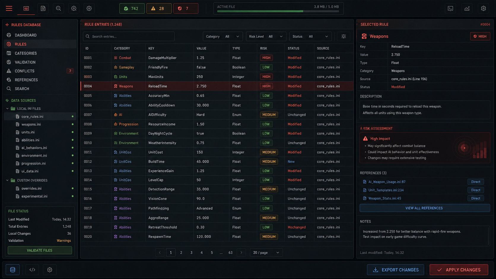

# MO Rulesmith

MO Rulesmith（心灵终结规则工坊）是一个本地运行的静态网页工具，用于可视化解析、浏览、修改并重新导出《红色警戒 2：心灵终结》的 `rulesmo.ini` 规则文件。



## 功能

- 上传并在浏览器本地解析大型 `rulesmo.ini`，不上传到服务器。
- 行级解析 INI，保留注释、空行、段落顺序、字段顺序和重复 Key。
- 按步兵、载具、飞机、建筑、武器、弹头、抛射体、护甲、超级武器等分类浏览。
- 内置中文本地化辅助数据，显示对象名称、字段中文名、字段说明和引用目标中文名。
- 搜索 Section、对象中文名、字段、字段中文名、值、引用目标和注释。
- 查看 Section 完整字段，直接编辑值，新增字段，注释化删除字段，恢复原值。
- 查看字段中文解释、修改方向、建议范围、风险等级和数值强弱判断。
- 支持单位到武器、武器到抛射体和弹头的引用跳转。
- 弹头详情页展示护甲倍率评价。
- 记录修改历史，支持单项撤销、全部撤销、导出 JSON / Markdown 修改记录。
- 内置自动维修、战役舒适版、百夫长爽玩版、单位视野增强等预设，应用前必须确认。
- 导出前进行安全检查，导出时只替换修改过的行，其余原文保持不变。

## 本地运行

```bash
npm install
npm run dev
```

构建静态文件：

```bash
npm run build
```

构建结果在 `dist/`，可部署到任意静态网站服务。

## 使用方法

1. 打开应用后选择或拖入你的 `rulesmo.ini`。
2. 在左侧选择分类，或搜索 `CNTR`、`Speed`、`Damage`、`ROF` 等关键词。
3. 点击任意 Section，在详情页查看字段、中文解释和引用链。
4. 直接编辑字段值，或使用“新增字段”“注释删除”“恢复原值”。
5. 在“修改记录”查看变更，必要时撤销。
6. 点击“导出”，确认安全检查提示后下载新的 `rulesmo.modified.YYYY-MM-DD.ini`。

## 常见字段解释

- `Strength`：血量。越大越耐打。
- `Armor`：护甲类型。会影响所有弹头倍率，属于高风险字段。
- `Cost`：造价。越低越容易量产。
- `TechLevel`：科技等级。`-1` 通常代表不可正常建造。
- `Prerequisite`：建造前置。可能影响战役脚本和 AI。
- `Sight`：视野。越大看得越远。
- `Speed`：移动速度。越大跑得越快。
- `ROT` / `TurretROT`：车体 / 炮塔转向速度。
- `Damage`：武器基础伤害。
- `ROF`：开火间隔。越小射得越快。
- `Range`：射程。越大打得越远。
- `Projectile`：武器使用的抛射体，高风险引用字段。
- `Warhead`：武器使用的弹头，高风险引用字段。
- `Verses` / `Versus.xxx`：弹头对护甲的伤害倍率。
- `CellSpread`：溅射范围。

## 安全修改建议

- 修改前备份原始 `rulesmo.ini`。
- 优先小幅调整数值，例如 `Speed +1`、`Strength +20%`、`ROF` 小幅降低。
- 谨慎修改 `Locomotor`、`MovementZone`、`Armor`、`Warhead`、`Projectile`、`Prerequisite`、`Owner` 等高风险字段。
- 改引用字段后检查目标 Section 是否存在。
- 删除字段默认使用注释化删除，便于回滚。

## 技术说明

- 技术栈：Vite、React、TypeScript、Tailwind CSS、Zustand、lucide-react。
- 中文本地化数据只用于界面展示，不会写入 `rulesmo.ini`。如果某些名称或字段解释不准确，可以维护 `src/data/` 下的 TypeScript 文件：
  - `moLocalization.zhCN.v2.ts`：对象、段落、单位、建筑、武器、弹头、抛射体等中文名。
  - `moFieldLocalization.zhCN.ts`：字段中文名、字段说明、修改建议、风险等级和数值评价。
- 核心逻辑位于 `src/lib/`：
  - `iniParser.ts`：行级 INI 解析。
  - `iniExporter.ts`：保真导出，只替换修改行。
  - `classifySections.ts`：Section 分类。
  - `fieldDocs.ts`：字段中文解释和风险等级。
  - `references.ts`：引用关系识别。
  - `valueAnalysis.ts`：数值强弱判断。
  - `presets.ts`：修改预设。
  - `validators.ts`：导出前安全检查。

## 免责声明

MO Rulesmith 是一个非官方 Mod 配置辅助工具。本工具不包含、不分发任何 Mental Omega 或 Command & Conquer 游戏资源。请在修改 `rulesmo.ini` 前备份原文件。错误修改可能导致游戏崩溃、战役异常或平衡变化。
